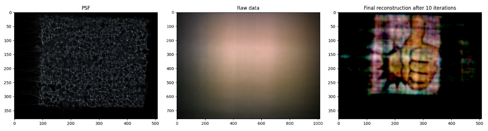

# LenslessPiCam: A Hardware and Software Platform for Lensless Computational Imaging with a Raspberry Pi



- [Setup](#setup).
- [Data for examples](#data).
- [Reconstruction](#recon).
- [Evaluating on a dataset](#eval).
- [Remote capture](#capture).
- [Remote display](#display).
- [Collecting MNIST](#mnist).
- [Citing this work](#cite).

This package provides functionalities to perform imaging with a lensless camera.
We make use of a low-cost implementation of the DiffuserCam [[1]](#1) where we
use a piece of tape instead of the lens and the [Raspberry Pi HQ camera sensor](https://www.raspberrypi.com/products/raspberry-pi-high-quality-camera)
([V2 sensor](https://www.raspberrypi.com/products/camera-module-v2/) is also
supported). However, the same principles can be used for a different diffuser/mask 
and a different sensor (although the capture script would change). The idea of
building a lensless camera from a Raspberry Pi and a piece of tape, and a 
dataset mentioned below come from Prof. Laura Waller's group at UC Berkeley:
- [Build your own DiffuserCam tutorial](https://waller-lab.github.io/DiffuserCam/tutorial).
- [DiffuserCam lensless MIR Flickr dataset](https://waller-lab.github.io/LenslessLearning/dataset.html) [[2]](#2).

So a huge kudos to them for the idea and making the tools/code/data available!

We've also made a few Medium articles to guide users through the process of
building the lensless camera, measuring data with it, and reconstruction. They are all
laid out in [this post](https://medium.com/@bezzam/a-complete-lensless-imaging-tutorial-hardware-software-and-algorithms-8873fa81a660).

Note that this material has been used for our graduate signal processing 
course at EPFL, and therefore includes some exercises / code to complete:
- `lensless.autocorr.autocorr2d`: to compute a 2D autocorrelation in the 
  frequency domain,
- `lensless.realfftconv.RealFFTConvolve2D`: to pre-compute the PSF's Fourier
  transform, perform a convolution in the frequency domain with the real-valued
  FFT, and vectorize operations for RGB.

If you are an instructor, you can request access to the solutions [here](https://drive.google.com/drive/folders/1Y1scM8wVfjVAo5-8Nr2VfE4b6VHeDSia?usp=sharing) 
or send an email to `eric[dot]bezzam[at]epfl[dot]ch`.

## Setup <a name="setup"></a>
The expected workflow is to have a local computer which interfaces remotely
with a Raspberry Pi equipped with the HQ camera sensor (or V2 sensor as in the 
original tutorial).

The software from this repository has to be installed on your both your local 
machine and the Raspberry Pi (from the `home` directory of the Pi). Below are
commands that worked for our configuration (Ubuntu 21.04), but there are 
certainly other ways to download a repository and install the library locally.
```bash
# download from GitHub
git clone git@github.com:LCAV/LenslessPiCam.git

# install in virtual environment
cd LenslessPiCam
python3 -m venv lensless_env
source lensless_env/bin/activate
pip install -e .

# -- extra dependencies for local machine for plotting/reconstruction
pip install -r recon_requirements.txt

# (optional) try reconstruction on local machine
python scripts/recon/admm.py --psf_fp data/psf/tape_rgb.png \
--data_fp data/raw_data/thumbs_up_rgb.png --n_iter 5
```

On the Raspberry Pi, you may also have to install the following:
```bash
sudo apt-get install libimage-exiftool-perl
sudo apt-get install libatlas-base-dev
```

It is also possible to install the library via `pip`:
```bash
pip install lensless
```

Note that we highly recommend using Python 3.9, as its [end-of-life](https://endoflife.date/python) is Oct 2025. Some Python library versions may not be available with earlier versions of Python.

For plotting on your local computer, you may also need to install [Tk](https://stackoverflow.com/questions/5459444/tkinter-python-may-not-be-configured-for-tk).

The scripts for remote capture and remote display assume that you can SSH to the
Raspberry Pi without a password. To see this up you can follow instruction from
[this page](https://medium.com/@bezzam/headless-and-passwordless-interfacing-with-a-raspberry-pi-ssh-453dd75154c3).
Do not set a password for your key pair, as this will not work with the provided
scripts.

We have noticed problems with locale when running the remote capture and display
scripts, for example:
```bash
perl: warning: Setting locale failed.
perl: warning: Please check that your locale settings:
...
```
This may arise due to incompatible locale settings between your local machine 
and the Raspberry Pi. There are two possible solutions to this, as proposed in 
[this forum](https://forums.raspberrypi.com/viewtopic.php?t=11870).
1. Comment `SendEnv LANG LC_*` in `/etc/ssh/ssh_config` on your laptop.
2. Comment `AcceptEnv LANG LC_*` in `/etc/ssh/sshd_config` on the Raspberry
Pi.

## Data for examples <a name="data"></a>

You can download example PSFs and raw data that we've measured [here](https://drive.switch.ch/index.php/s/NdgHlcDeHVDH5ww).
We recommend placing this content in the `data` folder.

You can download a subset for the [DiffuserCam Lensless Mirflickr Dataset](https://waller-lab.github.io/LenslessLearning/dataset.html)
that we've prepared [here](https://drive.switch.ch/index.php/s/vmAZzryGI8U8rcE)
with `scripts/prepare_mirflickr_subset.py`.

## Reconstruction <a name="recon"></a>

The core algorithmic component of `LenslessPiCam` is the abstract class 
`lensless.ReconstructionAlgorithm`. The three reconstruction strategies 
available in `LenslessPiCam` derive from this class:

- `lensless.GradientDescient`: projected gradient descent 
  with a non-negativity constraint. Two accelerated approaches are also
  available: `lensless.NesterovGradientDescent` and `lensless.FISTA`.
- `lensless.ADMM`: alternating direction method of multipliers (ADMM) with
  a non-negativity constraint and a total variation (TV) regularizer.
- `lensless.APGD`: accelerated proximal gradient descent with Pycsou
as a backend. Any differentiable or proximal operator can be used as long as it 
  is compatible with Pycsou, namely derives from one of 
  `DifferentiableFunctional` or `ProximableFunctional`.
  
New reconstruction algorithms can be conveniently implemented by deriving from 
the abstract class and defining the following abstract methods:

- the update step: `_update`.
- a method to reset state variables: `reset`.
- an image formation method: `_form_image`. 
  
One advantage of deriving from `lensless.ReconstructionAlgorithm` is that
functionality for iterating, saving, and visualization is already implemented. 
Consequently, using a reconstruction algorithm that derives from it boils down 
to three steps:

1. Creating an instance of the reconstruction algorithm.
2. Setting the data.
3. Applying the algorithm.

For example, for ADMM:
```python
    recon = ADMM(psf)
    recon.set_data(data)
    res = recon.apply(n_iter=n_iter)
```

A full running example can be run like so:
```bash
python scripts/recon/admm.py --psf_fp data/psf/tape_rgb.png \
--data_fp data/raw_data/thumbs_up_rgb.png --n_iter 5
```

A template for applying a reconstruction algorithm (including loading the data)
can be found in `scripts/recon/template.py`.

## Evaluating on a dataset <a name="eval"></a>

You can run ADMM on the [DiffuserCam Lensless Mirflickr Dataset](https://waller-lab.github.io/LenslessLearning/dataset.html)
with the following script.
```bash
python scripts/evaluate_mirflickr_admm.py --data <FP>
```
where `<FP>` is the path to the dataset.

However, the original dataset is quite large (25000 files, 100 GB). So we've 
prepared [this subset](https://drive.switch.ch/index.php/s/vmAZzryGI8U8rcE) (200
files, 725 MB) which you can also pass to the script. It is also possible to 
set the number of files.
```bash
python scripts/evaluate_mirflickr_admm.py \
--data DiffuserCam_Mirflickr_200_3011302021_11h43_seed11 \
--n_files 10 --save
```
The `--save` flag will save a viewable image for each reconstruction.

You can also apply ADMM on a single image and visualize the iterative 
reconstruction.
```bash
python scripts/apply_admm_single_mirflickr.py \
--data DiffuserCam_Mirflickr_200_3011302021_11h43_seed11 \
--fid 172
```

## Remote capture <a name="capture"></a>

You can remotely capture raw Bayer data with the following script.
```bash
python scripts/remote_capture.py --exp 0.1 --iso 100 --bayer --fp <FN> --hostname <HOSTNAME>
```
where `<HOSTNAME>` is the hostname or IP address of your Raspberry Pi, `<FN>` is
the name of the file to save the Bayer data, and the other arguments can be used
to adjust camera settings.

## Remote display <a name="display"></a>

For collecting images displayed on a screen, we have prepared some software to
remotely display images on a Raspberry Pi installed with this software and
connected to a monitor.

You first need to install the `feh` command line tool on your Raspberry Pi.
```bash
sudo apt-get install feh
```

Then make a folder where we will create and read prepared images.
```bash
mkdir ~/LenslessPiCam_display
cp ~/LenslessPiCam/data/original/mnist_3.png ~/LenslessPiCam_display/test.png
```

Then we can use `feh` to launch the image viewer.
```bash
feh LenslessPiCam_display --scale-down --auto-zoom -R 0.1 -x -F -Y
```

Then from your laptop you can use the following script to display an image on
the Raspberry Pi:
```bash
python scripts/remote_display.py --fp <FP> --hostname <HOSTNAME> \
--pad 80 --vshift 10 --brightness 90
```
where `<HOSTNAME>` is the hostname or IP address of your Raspberry Pi, `<FN>` is
the path on your local computer of the image you would like to display, and the 
other arguments can be used to adjust the positioning of the image and its
brightness.

## Collecting MNIST <a name="mnist"></a>

We provide a couple scripts to collect MNIST with the proposed camera.

Script that can be launched from the Raspberry Pi:
```bash
python scripts/collect_mnist_on_device.py --input_dir MNIST_original \
--output_dir MNIST_meas
```
If the MNIST dataset is not available at `MNIST_original` it will be downloaded
from [here](http://yann.lecun.com/exdb/mnist/). The above command will measure 
the training set. The `--test` flag can be used to measure the test set.
It is recommended to run the script from a [`screen`](https://linuxize.com/post/how-to-use-linux-screen/) session as it takes a long time to go through all the
files! The `--n_files <N_FILES>` option can be used to measure a user-specified
amount of files.

To remotely collect the MNIST dataset (although quite slow due to copying files
back and forth):
```bash
python scripts/collect_mnist.py --hostname <IP_ADDRESS> --output_dir MNIST_meas
```

## Citing this work <a name="cite"></a>

If you use these tools in your own research, please cite the following:
```
@misc{lenslesspicam,
	url = {https://infoscience.epfl.ch/record/294041?&ln=en},
	author = {Bezzam, Eric and Kashani, Sepand and Vetterli, Martin and Simeoni, Matthieu},
	title = {Lensless{P}i{C}am: A Hardware and Software Platform for Lensless Computational Imaging with a {R}aspberry {P}i},
	publisher = {Infoscience},
	year = {2022},
}
```

## References
<a id="1">[1]</a> 
Antipa, N., Kuo, G., Heckel, R., Mildenhall, B., Bostan, E., Ng, R., & Waller, L. (2018). DiffuserCam: lensless single-exposure 3D imaging. Optica, 5(1), 1-9.

<a id="2">[2]</a> 
Monakhova, K., Yurtsever, J., Kuo, G., Antipa, N., Yanny, K., & Waller, L. (2019). Learned reconstructions for practical mask-based lensless imaging. Optics express, 27(20), 28075-28090.

<a id="3">[3]</a> 
Boyd, S., Parikh, N., & Chu, E. (2011). Distributed optimization and statistical learning via the alternating direction method of multipliers. Now Publishers Inc.
