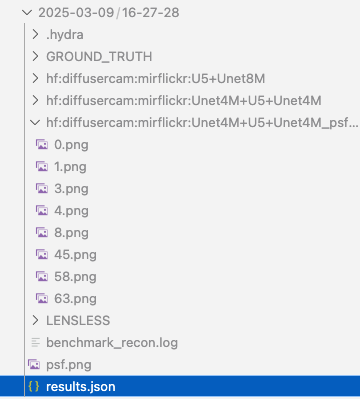

# Benchmark reconstruction approaches


The following datasets are supported (hyperlinks takes to relevant configuration description):

- [DiffuserCam](#diffusercam)
- [TapeCam](#tapecam)
- [DigiCam with a Single Mask](#digicam-with-a-single-mask)
- [DigiCam with Multiple Masks](#digicam-with-multiple-masks)
- [DigiCam CelebA](#digicam-celeba)
- [MultiLens under External Illumination](#multilens-under-external-illumination)

By commenting/uncommenting relevant sections in the configuration file, you can benchmark different architectures (including conventional ADMM).
The corresponding models and dataset will be downloaded from Hugging Face (if not done already): 

With the arguments `save_idx` you can set which examples to visualize from the dataset, and with `n_files` you can set the number of examples for the benchmark (to not have to run on the whole dataset). 

All available models can be found in the [`model_dict`](https://github.com/LCAV/LenslessPiCam/blob/650a1498325f1e24b1677c918bf3e5de01ca3936/lensless/recon/model_dict.py#L27) dictionary. The nested keys are organized as such:

- First key indicates the camera, e.g. `diffusercam`, `tapecam`, `digicam`, `multilens`.
- The second key indicates the dataset, e.g. `mirflickr`.
- The third key indicates the model which can be composed of multiple components separated by `+`. For camera inversion, there is `U5` for five unrolled iterations of ADMM, `TrainInv` for trainable inversion (FlatNet), `MMCN` for unrolled ADMM with a compensation branch, `MWDN` for multi wiener deconvolution network. For pre- and post-processors, there is `Unet` for a UNetRes model. `2M`, `4M`, `8M` indicate the number of parameters in the component in the millions. `psfNN` indicates that there is a PSF correction model.

Inside the configuration files, all keys will be concatenated with together, separated by `"` and prefixed with `hf`. For example, `"hf:diffusercam:mirflickr:Unet4M+U5+Unet4M"` indicates a model with a UNetRes pre-processor with 4M parameters, five unrolled iterations of ADMM, and a UNetRes post-processor with 4M parameters trained on the MirFlickr dataset gathered with DiffuserCam.

The configuration files are based on [Hydra](https://hydra.cc/docs/intro/), which allows for easy parameter management. For more on Hydra, check out this [blog post](https://medium.com/@bezzam/hydra-for-cleaner-python-code-and-better-reproducibility-in-research-c035028101f9).

The output of the benchmark will be stored in the `benchmark` folded with the appropriate timestamp.

## DiffuserCam

- Dataset link: https://huggingface.co/datasets/bezzam/DiffuserCam-Lensless-Mirflickr-Dataset-NORM
- Default configuration: https://github.com/LCAV/LenslessPiCam/blob/main/configs/benchmark/diffusercam.yaml

The following command will run the benchmark on the DiffuserCam dataset with the configuration specified in ``configs/benchmark/diffusercam.yaml``:
```bash
python scripts/eval/benchmark_recon.py -cn diffusercam
```

An output folder will be created in the `benchmark` directory with the appropriate timestamp (as shown below). Inside the folder will be example reconstructinos for each model and metrics can be found in ``results.json``.




## TapeCam

- Dataset link: https://huggingface.co/datasets/bezzam/TapeCam-Mirflickr-25K
- Default configuration: https://github.com/LCAV/LenslessPiCam/blob/main/configs/train/tapecam.yaml


The following command will run the benchmark on the TapeCam dataset with the configuration specified in ``configs/benchmark/tapecam.yaml``:
```bash
# unrolled ADMM
python scripts/recon/train_learning_based.py -cn tapecam
```

## DigiCam with a Single Mask

- Dataset link: https://huggingface.co/datasets/bezzam/DigiCam-Mirflickr-SingleMask-25K
- Default configuration: https://github.com/LCAV/LenslessPiCam/blob/main/configs/train/digicam.yaml

The following command will run the benchmark on the DigiCam dataset with the configuration specified in ``configs/benchmark/digicam.yaml``:
```bash
# unrolled ADMM
python scripts/recon/train_learning_based.py -cn digicam
```

## DigiCam with Multiple Masks

- Dataset link: https://huggingface.co/datasets/bezzam/DigiCam-Mirflickr-MultiMask-25K
- Default configuration: https://github.com/LCAV/LenslessPiCam/blob/main/configs/train/digicam_multimask.yaml

The following command will run the benchmark on the DigiCam Multimask dataset with the configuration specified in ``configs/benchmark/digicam_multimask.yaml``:
```bash
# unrolled ADMM
python scripts/recon/train_learning_based.py -cn digicam_multimask
```

## DigiCam CelebA

- Dataset link: https://huggingface.co/datasets/bezzam/DigiCam-CelebA-26K
- Default configuration: https://github.com/LCAV/LenslessPiCam/blob/main/configs/train/digicam_celeba.yaml

The following command will run the benchmark on the DigiCam CelebA dataset with the configuration specified in ``configs/benchmark/digicam_celeba.yaml``:
```bash
# unrolled ADMM
python scripts/recon/train_learning_based.py -cn digicam_celeba
```

## MultiLens under External Illumination

- Dataset link: https://huggingface.co/datasets/Lensless/MultiLens-Mirflickr-Ambient
- Default configuration: https://github.com/LCAV/LenslessPiCam/blob/main/configs/train/multilens_ambient.yaml


The following command will run the benchmark on the MultiLens dataset with the configuration specified in ``configs/benchmark/multilens_ambient.yaml``:
```bash
# unrolled ADMM
python scripts/recon/train_learning_based.py -cn multilens_ambient
```
