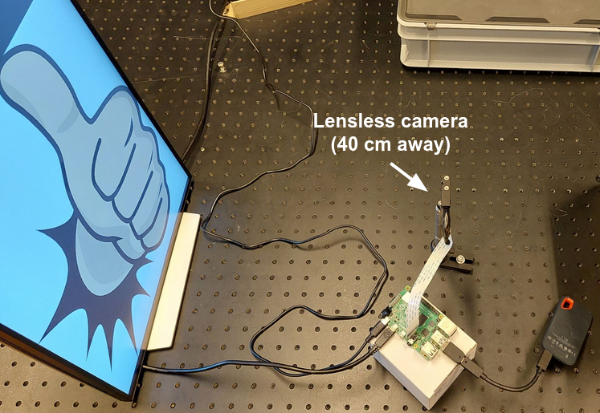

Demo (measurement and reconstruction)
=====================================

A full demo script can be found in ``scripts/demo.py``. Its configuration
file can be found in ``configs/demo.yaml``.

It assumes the following setup:

* You have a Raspberry Pi (RPi) with ``LenslessPiCam`` installed.
* You have a PC with ``LenslessPiCam`` installed.
* The RPi and the PC are connected to the same network.
* You can SSH into the RPi from the PC `without a password <https://medium.com/@bezzam/headless-and-passwordless-interfacing-with-a-raspberry-pi-ssh-453dd75154c3>`_.
* The RPi is connected to a lensless camera and a display.
* The display is configured to display images in full screen, as described in :ref:`measurement<Preparing an external monitor for displaying images (remote display)>`.
* The PSF of the lensless camera is known and saved as an RGB file.

With the above setup, you can run the demo script on the PC to:

#. Display an image on the screen.
#. Capture an image from the lensless camera.
#. Send the captured image to the PC.
#. Perform the reconstruction on the PC.

with the following command:

.. code-block:: bash

    python scripts/demo.py \
        rpi.username=USERNAME \
        rpi.hostname=HOSTNAME \
        camera.psf=PSF_FP \
        fp=data/original/mnist_3.png \
        recon.algo=admm \
        recon.downsample=8 \
        recon.use_torch=True \
        plot=True

where ``USERNAME`` and ``HOSTNAME`` are the username and hostname of the RPi,
and ``PSF_FP`` is the path to the PSF file.

Note that there is a custom post-processing by default to extract a 
specific region. You may want to modify this (``postproc.crop_hor``
and ``postproc.crop_vert``). For your setup, you may also need to change
the display settings (resolution, brightness, etc) and the camera settings
(exposure, etc). In the end, you may just want to make your own configuration
file that "inherits" from ``configs/demo.yaml``:

.. code-block:: yaml

    defaults:
        - demo
        - _self_

    # Your custom settings here.

And then run the demo script with:

.. code-block:: bash

    python scripts/demo.py -cn CONFIG_FP

where ``CONFIG_FN`` is the name of your configuration file (saved in
``configs/``).

Below are example outputs from our setup and the above script.

.. image:: https://github.com/LCAV/LenslessPiCam/raw/main/scripts/recon/example.png
    :alt: Example demo output.
    :align: center

Telegram demo
-------------

On the Telegram messasing application, you can search for the bot ``@LenslessBot``. If
it is running, you can send pictures to our setup at EPFL!

You can also run the demo on your own server with the Telegram messaging application. To do so, 
you need to:

#. Create a Telegram bot and get its token. `Here <https://zlliu.medium.com/quickstart-coding-your-own-python-telegram-bot-1c3168e04d9d>`_ is one tutorial and plenty others can be found online.

#. Set the commands for the bot with the ``/setcommands`` command. As of 30 June 2023, the commands we have set are:

    .. code :: none

        help - Get more info about this bot.
        mnist - Set mnist data as input and reconstruct.
        thumb - Set a thumbs up image as input data and reconstruct.
        face - Set an image of a face as input and reconstruct.
        psf - Measure a proxy PSF by setting point source on screen.
        brightness - Set the screen brightness, retake picture, and reconstruct.
        fista - Apply FISTA on current measurement.
        admm - Apply ADMM on current measurement.
        unrolled - Apply unrolled ADMM on current measurement.

#. Install Telegram Python API (and other dependencies): ``pip install python-telegram-bot emoji==1.7 pilmoji``.

#. Make sure ``LenslessPiCam`` is installed on your server and on the Raspberry Pi, and that the display is configured to display images in full screen, as described in :ref:`measurement<Preparing an external monitor for displaying images (remote display)>`.

#. Prepare your configuration file using ``configs/telegram_demo.yaml`` as a template. You will have to set ``token`` to the token of your bot, ``rpi_username`` and ``rpi_hostname`` to the username and hostname of your Raspberry Pi, ``psf:fp`` to the path of your PSF file, and ``config_name`` to a demo configuration that e.g. worked for above. You may also want to set what algorithms you are willing to let the bot support (note that as of 12 March 2023, unrolled ADMM requires a GPU).

#. You can download some images that we use for our demo `here <https://drive.switch.ch/index.php/s/NdgHlcDeHVDH5ww?path=%2Foriginal>`_. You can also use your own images.

#. Now you can run the server for the Telegram bot! It is recommended to do in a screen session.

    .. code-block:: bash

        screen -S telegram_bot

        # in screen session
        python scripts/demo/telegram_bot.py -cn CONFIG_FN
        # Ctrl+A, followed by D to detach from screen session
        # screen -r telegram_bot to reattach

#. You will most certainly need to adjust exposure and shifting parameters in your configuration, ``demo.yaml``, and ``scripts/demo/telegram_bot.py``.

