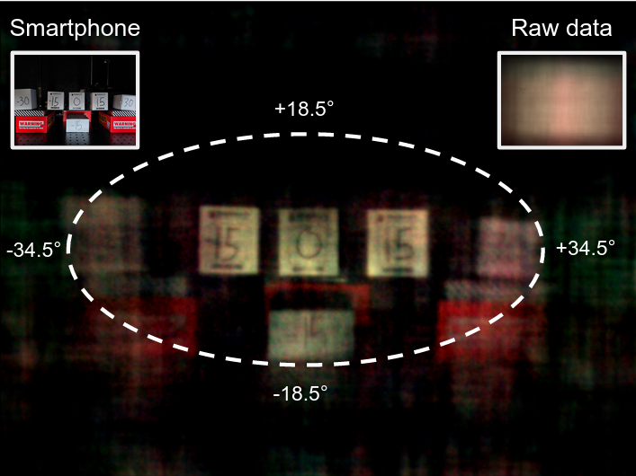

# Summary

Lensless imaging seeks to replace or remove the lens in a conventional imaging system. 
The earliest cameras were in fact lensless, relying on long exposure times to form images on the other end of a small aperture in a darkened room/container (*camera obscura*). 
The introduction of a lens allowed for more light throughput and therefore shorter exposure times, while retaining sharp focus. 
The incorporation of digital sensors readily enabled the use of computational imaging techniques to post-process and enhance raw images (e.g. via deblurring, inpainting, denoising, sharpening).
Recently, imaging scientists have started leveraging computational imaging as an integral part of lensless imaging systems, allowing them to form viewable images from the highly multiplexed raw measurements of lensless cameras (see [@boominathan2022recent] and references therein for a comprehensive treatment of lensless imaging).
This represents a real paradigm shift in camera system design as there is more flexibility to cater the hardware to the application at hand (e.g., lightweight or flat designs).
This increased flexibility comes, however, at the price of a more demanding post-processing of the raw digital recordings and a tighter integration of sensing and computation, often difficult to achieve in practice due to inefficient interactions between the various communities of scientists involved. 
With `LenslessPiCam`, we provide an easily accessible hardware and software framework to enable researchers, hobbyists, and students to implement and explore practical and computational aspects of lensless imaging.

# Statement of need

Being at the interface of hardware, software, and algorithm design, the field of lensless imaging necessitates a broad array of competences that might deter newcomers to the field.
The purpose of `LenslessPiCam` is to provide a complete toolkit with low-cost, accessible hardware designs and open-source software, to quickly enable the exploration of novel ideas for hardware, software, and algorithm design.

The DiffuserCam tutorial [@diffusercam] served as a great starting point to the present toolkit as it demonstrates that a working lensless camera can be built with cheap hardware: a Raspberry Pi, the [Camera Module 2](https://www.raspberrypi.com/products/camera-module-v2), and double-sided tape.
The authors also provide Python implementations of two image reconstruction  algorithms: variants of gradient descent (GD) with a non-negativity constraint; and the alternating direction method of multipliers (ADMM) [@boyd2011distributed] with an additional total variation (TV) prior.

The resolution and quality of the reconstructed images for the DiffuserCam tutorial is poor and the processing pipeline is limited to grayscale reconstruction. 
With `LenslessPiCam`, we improve the reconstruction by using the newer [HQ camera](https://www.raspberrypi.com/products/raspberry-pi-high-quality-camera/) as well as a more versatile and generic RGB computational imaging pipeline. 
See \autoref{fig:compare_cams} for a comparison between the two cameras.

![ADMM reconstruction of (a) an image of thumbs-up on a phone 40 cm away for (b) the original DiffuserCam tutorial [@diffusercam] and (c) our camera with RGB support.](compare_cams.png){#fig:compare_cams width=30%}


Similar to [@diffusercam], the core image reconstruction functionality of `LenslessPiCam` depends on NumPy [@numpy] and SciPy [@scipy].
Moreover, `LenslessPiCam` also provides support for Pycsou [@pycsou], a universal and reusable software environment providing key computational imaging functionalities and tools with great modularity and interoperability.
This results in a more flexible reconstruction workflow, allowing for the quick prototyping of advanced post-processing schemes with more sophisticated image priors.
PyTorch [@pytorch] support also enables the use of GPUs for faster reconstruction, and the use of deep learning for image reconstruction.

`LenslessPiCam` is designed to be used by researchers, hobbyists, and students. In the past, we have found such open-source hardware and software platforms to be a valuable resource for researchers [@bezzam2017hardware] and students alike [@bezzam2019teaching]. Moreover, we have used `LenslessPiCam` in our own work for performing measurements, simulating data, and image reconstruction [@bezzam2022privacy], and in our graduate-level signal processing course as a [final project](https://infoscience.epfl.ch/search?ln=en&rm=&ln=en&sf=&so=d&rg=10&c=Infoscience%2FArticle&c=Infoscience%2FBook&c=Infoscience%2FChapter&c=Infoscience%2FConference&c=Infoscience%2FDataset&c=Infoscience%2FLectures&c=Infoscience%2FPatent&c=Infoscience%2FPhysical%20objects&c=Infoscience%2FPoster&c=Infoscience%2FPresentation&c=Infoscience%2FProceedings&c=Infoscience%2FReport&c=Infoscience%2FReview&c=Infoscience%2FStandard&c=Infoscience%2FStudent&c=Infoscience%2FThesis&c=Infoscience%2FWorking%20papers&c=Media&c=Other%20doctypes&c=Work%20done%20outside%20EPFL&c=&of=hb&fct__2=LCAV&p=diffusercam).
\autoref{fig:screen_examples} demonstrates reconstructed images of our students using `LenslessPiCam` and images that were projected on a monitor 40cm away; the figure is adapted from [this report](https://infoscience.epfl.ch/record/291501?ln=en).

{#fig:screen_examples width=100%}

As opposed to \autoref{fig:compare_cams} and \autoref{fig:screen_examples}, which show reconstructions of back-illuminated objects, \autoref{fig:in_the_wild} demonstrates reconstructions of objects illuminated with an external source.

{#fig:in_the_wild width=90%}

\autoref{fig:tape_fov} demonstrates the field-of-view (FOV) of the proposed system with double-sided tape. Objects are 40cm away.

{#fig:tape_fov width=80%}

# Contributions

With respect to the DiffuserCam tutorial [@diffusercam], we have made the following contributions. 
In terms of hardware, as shown in \autoref{fig:hardware}, we:

- make use of the HQ camera sensor ($50): 4056 x 3040 pixels (12.3 MP) and 7.9 mm sensor diagonal, compared to 3280 × 2464 pixels (8.1 MP) and 4.6 mm sensor diagonal for the Camera Module 2 ($30). A tutorial for building our proposed camera can be found on [Medium](https://medium.com/@bezzam/building-a-diffusercam-with-the-raspberry-hq-camera-cardboard-and-tape-896b6020aff6);
- provide the design and firmware for a cheap point source generator (needed for calibration), which consists of an Arduino, a white LED, and a cardboard box. A tutorial for building this system can be found on [Medium](https://medium.com/@bezzam/measuring-an-optical-psf-with-an-arduino-an-led-and-a-cardboard-box-2f3ddac660c1).
  
{#fig:hardware width=95%}

With respect to reconstruction algorithms, we:

- provide significantly faster implementations of GD and ADMM;
- extend the above reconstructions to RGB;
- provide PyTorch / GPU support;
- provide an object-oriented structure that is easy to extend for exploring new algorithms;
- provide an object-oriented interface to Pycsou for solving lensless imaging inverse problems. Pycsou is a Python package for solving inverse problems of the form
\begin{equation}\label{eq:fourier}
\min_{\mathbf{x}\in\mathbb{R}^N} \,F(\mathbf{y}, \mathbf{G} \mathbf{x})\quad+\quad \lambda\mathcal{R}(\mathbf{x}),
\end{equation}
where $F$ is a data-fidelity term between the observed and predicted measurements $\mathbf{y}$ and $\mathbf{G}\mathbf{x}$, respectively, $\mathcal{R}$ is a regularization component (could consist of more than one prior), and $\lambda >0$ controls the amount of regularization.

We also provide functionalities to:

- remotely display data on an external monitor (as done for \autoref{fig:screen_examples}), which can be used to automate raw data measurements to, e.g., gather a dataset;
- simulate measurements, given a point spread function (PSF) of a lensless camera. A tutorial can be found on [Medium](https://medium.com/@bezzam/simulating-camera-measurements-through-wave-optics-with-pytorch-support-faf3fa620789);
- evaluate reconstructions on a variety of metrics: mean squared error (MSE), peak signal-to-noise ratio (PSNR), structural similarity index measure (SSIM), and learned perceptual image patch similarity (LPIPS). A tutorial can be found on [Medium](https://medium.com/@bezzam/image-similarity-metrics-applied-to-diffusercam-21998967af8d);
- quantitatively evaluate the PSF of the lensless camera.

As previous noted, we have written a set of Medium articles to guide users through the process of building and using the proposed lensless camera. 
An overview of these articles can be found [here](https://medium.com/@bezzam/a-complete-lensless-imaging-tutorial-hardware-software-and-algorithms-8873fa81a660).
A [ReadTheDocs](https://lensless.readthedocs.io) page also provides an overview of all the available features.

In the following sections, we describe some of these contributions, and quantify them (where appropriate).

# High-level, modular functionality for reconstructions

The core algorithmic component of `LenslessPiCam` is the abstract class `lensless.ReconstructionAlgorithm`. 
The three reconstruction strategies available in `LenslessPiCam` derive from this class:

- `lensless.GradientDescient`: projected GD with a non-negativity constraint. Two accelerated approaches are also available: `lensless.NesterovGradientDescent` [@nesterov1983method] and `lensless.FISTA` [@beck2009fast];
- `lensless.ADMM`: ADMM with a non-negativity constraint and a TV regularizer;
- `lensless.APGD`: accelerated proximal GD with Pycsou as a backend. Any differentiable or proximal operator can be used as long as it is compatible with Pycsou, namely derives from one of [`DiffFunc`](https://github.com/matthieumeo/pycsou/blob/a74b714192821501371c89dbd44eac15a5456a0f/src/pycsou/abc/operator.py#L980) or [`ProxFunc`](https://github.com/matthieumeo/pycsou/blob/a74b714192821501371c89dbd44eac15a5456a0f/src/pycsou/abc/operator.py#L741).
  
One major advantage of deriving from `lensless.ReconstructionAlgorithm` is that code duplication across algorithm can be minimized as it handles most of the common functionality, i.e., efficiently computing 2D Fourier transforms (needed to solve \autoref{eq:fourier}), iteration logic, saving intermediate outputs, and visualization. 
Using a reconstruction algorithm that derives from it boils down to three steps:

1. Creating an instance of the reconstruction algorithm.
2. Setting the data.
3. Applying the algorithm.

For example, for ADMM (full example in `scripts/recon/admm.py`):
```python
    recon = ADMM(psf)
    recon.set_data(data)
    res = recon.apply(n_iter=n_iter)
```

Example reconstruction scripts can be found in [`scripts/recon`](https://github.com/LCAV/LenslessPiCam/tree/main/scripts/recon). The Hydra framework [@Yadan2019Hydra] is used to configure the various reconstruction algorithms, with the default configuration (`defaults_recon.yaml`) and others located in the [`configs`](https://github.com/LCAV/LenslessPiCam/tree/main/configs) folder.


# Efficient reconstruction

In Table 1, we compare the processing time of DiffuserCam's and `LenslessPiCam`'s implementations for grayscale reconstruction of:

1. GD using FISTA with a non-negativity constraint.
2. ADMM with a non-negativity constraint and a TV regularizer.

The DiffuserCam implementations can be found [here](https://github.com/Waller-Lab/DiffuserCam-Tutorial), while `lensless.APGD` and `lensless.ADMM` are used for `LenslessPiCam`. 
The comparison is done on 
a Dell Precision 5820 Tower X-Series (08B1) machine with an Intel i9-10900X 3.70 GHz processor (10 cores, 20 threads), running Ubuntu 20.04.5 LTS and (when applicable) an NVIDIA RTX A5000 GPU.
<!-- a Lenovo Thinkpad P15 with 16 GB RAM and a 2.70 GHz processor (6 cores, 12 threads), running Ubuntu 21.04. -->

|               |   GD   |  ADMM  |
|:-------------:|:------:|:------:|
|  DiffuserCam  |  246 s | 6.81 s |
| `LenslessPiCam` (`numpy`) | 21.1 s | 1.26 s |
| `LenslessPiCam` (`torch`, CPU) | 4.32 s | 272 ms |
| `LenslessPiCam` (`torch`, GPU) | 274 ms | 2.88 ms |
: Benchmark grayscale reconstruction. 300 iterations for gradient descent (GD)
and 5 iterations for alternating direction method of multipliers (ADMM).

In Table 1, we observe an 11.7x reduction in computation time for GD and a 2.4x reduction for ADMM. 
This comes from:

- our object-oriented implementation of the algorithms, which allocates all the necessary memory beforehand and pre-computes data-independent terms, such as forward operators from the point spread function (PSF);
- our use of the real-valued fast Fourier transform (FFT), which is possible since we are working with image intensities. Our convolver/deconvolver is implemented as an object - [`RealFFTConvolve2D`](https://github.com/LCAV/LenslessPiCam/blob/e31c9a7c8c87d30d4881b1123d849e7667b2e335/lensless/rfft_convolve.py#L16) -  that pre-computes the FFT of the PSF and supports SciPy and PyTorch backends.

When using a GPU (through PyTorch), we observe a significant reduction in computation time: 898x and 2360x reduction for GD and ADMM, respectively.

# Quantifying performance

To methodically compare different reconstruction approaches, it is necessary to quantify the performance. 
To this end, `LenslessPiCam` provides functionality to extract regions of interest from the reconstruction and compare them with the original image via multiple metrics:

- [Mean-squared error](https://en.wikipedia.org/wiki/Mean_squared_error) (MSE), where lower is better and the minimum value is 0;
- [Peak signal-to-noise ratio](https://en.wikipedia.org/wiki/Peak_signal-to-noise_ratio) (PSNR), where higher is better with values given in decibels (dB);
- [Structural similarity index measure](https://en.wikipedia.org/wiki/Structural_similarity) (SSIM), where values are within [-1, 1] and higher is better;
- Learned perceptual image patch similarity (LPIPS) [@zhang2018perceptual], where values are within [0, 1] and lower is better.

MSE, PSNR, and SSIM are computed using `skimage.metrics`  [@van2014scikit], while LPIPS is computed using `lpips` [@lpips]. MSE and PNSR compare images pixel-wise, while SSIM and LPIPS compare images patch-wise.

\autoref{fig:metric} and Table 2 show how a reconstruction can be evaluated against an original image, using [`scripts/compute_metrics_from_original.py`](https://github.com/LCAV/LenslessPiCam/blob/main/scripts/compute_metrics_from_original.py).

{#fig:metric width=60%}

|  MSE  | PSNR |  SSIM | LPIPS |
|:-----:|------|:-----:|:-----:|
| 0.164 | 7.85 | 0.405 | 0.645 |
: Metrics for \autoref{fig:metric}.

One limitation with comparing the reconstructed image (from measurements) directly with the original image is that the lighting during measurement can lead to rather poor results on the metrics, even though the content is visually similar (as in \autoref{fig:metric}).
To mitigate this difference, we can compare the reconstructed image with the image displayed on the screen, but captured with a lensed camera. 
In the next section, we describe the functionalities `LenslessPiCam` provides for collecting such data and using existing datasets.
Alternatively, simulation can be used to compare reconstruction algorithms without having to collect data.

# Measured and simulated data

Sometimes it may be of interest to perform an exhaustive evaluation on a large dataset.
`LenslessPiCam` could be used for collecting such a dataset with the proposed camera by using the remote display and capture scripts, i.e. [`scripts/remote_display.py`](https://github.com/LCAV/LenslessPiCam/blob/main/scripts/remote_display.py) and [`scripts/remote_capture.py`](https://github.com/LCAV/LenslessPiCam/blob/main/scripts/remote_capture.py), respectively.

Moreover, the authors of [@monakhova2019learned] have already collected a dataset of 25,000 parallel measurements, namely 25,000 pairs of DiffuserCam and lensed camera images [@diffusercamdataset].
`LenslessPiCam` offers functionality to evaluate a reconstruction algorithm on the full dataset (100 GB), or a [subset](https://drive.switch.ch/index.php/s/vmAZzryGI8U8rcE) of 200 files (725 MB) that we have prepared.
Note that this dataset is collected with a different lensless camera, but is nonetheless useful for exploring reconstruction techniques.


Table 3 shows the average metric results after applying 100 iterations of ADMM
to the subset we have prepared, using [`scripts/evaluate_mirflickr_admm.py`](https://github.com/LCAV/LenslessPiCam/blob/main/scripts/evaluate_mirflickr_admm.py).

|  MSE  | PSNR |  SSIM | LPIPS |
|:-----:|------|:-----:|:-----:|
| 0.0797 | 12.7 | 0.535 | 0.585 |
: Average metrics for 100 iterations of ADMM on a subset (200 files) of the DiffuserCam Lensless Mirflickr Dataset.

One can also visualize the performance on a single file of the dataset, e.g., by using [`scripts/apply_admm_single_mirflickr.py`](https://github.com/LCAV/LenslessPiCam/blob/main/scripts/apply_admm_single_mirflickr.py) to show how the reconstruction changes as the number of iterations increase.[^9] The 
final reconstruction and outputed metrics are shown in 
\autoref{fig:dataset_single_file} and Table 4.

{#fig:dataset_single_file  width=90%}

|  MSE  | PSNR |  SSIM | LPIPS |
|:-----:|------|:-----:|:-----:|
| 0.0682 | 11.7 | 0.486| 0.504 |
: Metrics for \autoref{fig:dataset_single_file}.

Scripts inside [`scripts/sim`](https://github.com/LCAV/LenslessPiCam/tree/main/scripts/sim) show how to simulate lensless camera measurements given a PSF, most notably with PyTorch compatibility for easy integration with machine learning tasks. This approach can be used to conveniently compare reconstruction algorithms without having to collect data.

# Conclusion

In summary, `LenslessPiCam` provides all the necessary hardware designs and software to build, use, and evaluate a lensless camera with low-cost and accessible components. 
Furthermore, a simulation framework allows users to experiment with lensless imaging without having to build the camera.
As we continue to use `LenslessPiCam` as a research and educational platform, we hope to investigate and incorporate:

- computational refocusing and 3D imaging;
- video reconstruction;
- on-device reconstruction;
- programmable masks;
- data-driven, machine learning reconstruction techniques.

# Acknowledgements and disclosure of funding

We acknowledge feedback from Julien Fageot and the students during the first iteration of this project in our graduate course.

This work was in part funded by the Swiss National Science Foundation (SNSF) under grants CRSII5 193826 “AstroSignals - A New Window on the Universe, with the New Generation of Large Radio-Astronomy Facilities” (M. Simeoni), 200 021 181 978/1 “SESAM - Sensing and Sampling: Theory and Algorithms” (E. Bezzam) and CRSII5 180232 “FemtoLippmann - Digital twin for multispectral imaging” (S. Kashani).

# References